# **ALGORITMO**

## **Definición**

Es un conjunto de instrucciones o reglas bién definidas, organizadas y finitas que permiten solucionar un determinado problema mediante pasos sucesivos para obtener un resultado.

Generalmente los algoritmos está más asociados con el ámbito matemático, pero no siempre es así, ya que los algortimos podemos verlos en cualquier ámbito, por citar algunos ejemplos:

+ Una receta de cocina.
+ Instructivos para juegos de mesa.
+ Pasos para llegar a un parque.
+ Reglas al practicar un deporte.

Existen ciertas propiedades de los algoritmos que son:

1. Tiempo secuencial: funcionan paso a paso sin alterar su orden de ejecución

2. Estado abstracto: cada algoritmo es independiente de su implementación.

3. Exploracion acotada: la transición de sus estados queda fija y finita.

Hay varias formas de representar un algoritmo; en programación veremos las 2 formas más comunes de representar a los algoritmos:

## **Diagramas de Flujo**

Los diagramas de flujo son una represanción gráfica y sencilla de un algoritmo fácil de comprender para cualquier persona que no necesariamente tenga conocimientos de computación o informática.

Generalmente un diagrama de flujo representa un único punto de inicio y cierre. Los símbolos más representados en los diagramas de flujo son la **flecha** (que indica un sentido y una trayectoria), el **rectágulo** (que representa un proceso o evento), el **rombo** (una condición), el **círculo** (un punto de conexión de varios eventos o procesos).

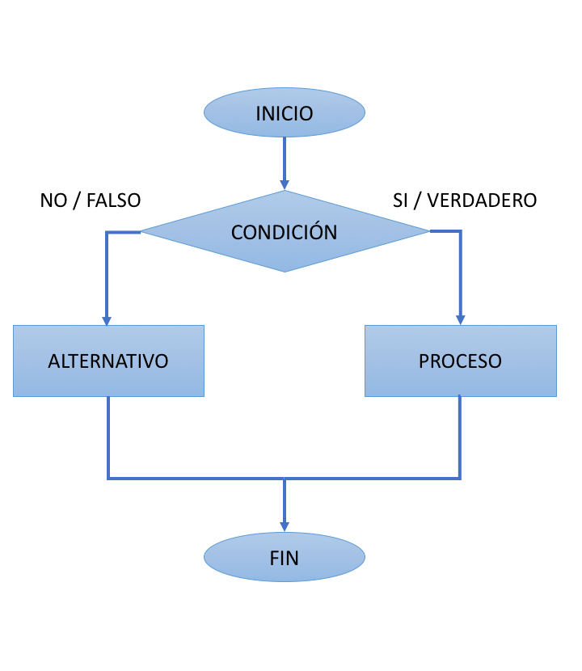

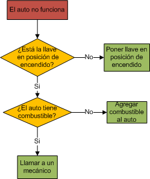

## **Pseudocódigo**

El pseudocódigo es considerado cómo una descripción de un algoritmo que es totalmente independiente de los lenguajes de programación para que pueda ser interpretado por cualquier persona; se excluyen algunos datos que no son necesarios o irrelevantes.

Hay que tener en cuenta que para desarrollar el pseudocódigo, se deben de tener en cuenta con diversos tipos de **Estructuras de Control** que son de tres clases:

+ Selectivas. Las instrucciones selectivas representan instrucciones que pueden o no ejecutarse, según el cumplimiento de una condición

+ Secuenciales. Las instrucciones se siguen en una secuencia fija que normalmente viene dada de arriba hacia abajo.

+ Iterativas. Representan la ejecución de instrucciones en más de una vez.

La definición de los datos en el pseudocódigo se da por supuesta, sobre todo las variables sencillas, si se emplea formaciones cómo pilas, colas, vectores, o registros. Aquí se mencionan las más usuales e importantes:

**Funciones y operaciones**. Las operaciones aritméticas se usan y representan de la forma usual que en matemáticas.

**Bucles o condicionales**. Se repite mientras la condición sea cierta, si al llegar por primera vez la condición sea falsa, dependiendo de la estructura, puede repetirse o terminar la condición con dicha estructura.


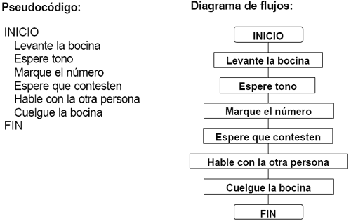

# **ESTRUCTURAS DE DATOS**

## **Definición**

La estructura de datos es una manera organizada para manejar datos de manera eficiente para usos tales cómo consulta, *indexación de Internet*, etc. La estructura de datos es clave para el diseño de algortimos eficientes y métodos en los lenguajes de programación.

La estructura de datos en la programación son una forma de buscar la organización, manipulación, consulta e inserción de datos de una manera más eficiente.

Los diferentes tipos de arreglos en las estructuras de datos son las siguientes:

## **CADENAS**

Las candenas son las estructura más simple y se define cómo una secuencia lineal de carácteres alfanuméricos que se pueden interpretar cómo un único dato. Su longitud puede ser fija o variable. Sobre los datos de tipo cadena, se pueden realizar las siguientes operaciones:

1. **Asignación.** Se guarda un dato que puede ser una constante; una variable o una expresión que puede ser un dato tipo cadena. Por ejemplo:
```Shell
nombre <--- "Israel"
nombre <--- mi-nombre-de-pila
```

2. **Concatenación.** Se forma una cadena a partir de otras 2 ya existentes *yuxtaponiendo* los carácteres de ambas cadenas. Se denota con // al operador de concatenación, ejemplo:
```Shell
"ab" // "cd" es "abcd"
```

Notese que las constantes de tipo cadena se escriben entre comillas para no confundirlos con nombres de variables u otros identificadores.


3. **Extracción de subcadena.** Permite formar una cadena (subcadena) a partir de otra ya existente y la subcadena forma otro tramo consecutivo. Si **NOMBRE** es una variable de tipo cadena que contiene **"ISRAEL ISAAC"** y se denota por **(n : m)** la extracción de **m** carácteres tomados a partir del lugar **n** , entonces **NOMBRE** (8:5) es una subcadena que contiene a **"ISAAC"**.

De igual manera se puede aplicar para obtener un sólo carácter. Usándo el ejemplo anterior NOMBRE (8:1) = **"I"**.

4. **Obtener la longitud de la cadena.** La longitud de la cadena es un dato tipo entero, cuyo valor es el número de carácteres que contiene ésta. La longitud se obtiene consultando el número de la primera casilla y de igual forma se puede obtener con la última casilla restando -1.

5. **Comparación de cadenas.** Consiste en comparar dos cadenas carácter a carácter comenzando por el primero de la izquierda; el orden de comparación viene dado por el código de *ASCII* . Así la expresion booleana: "Jose" < "Julio" se evaluará cómo verdadera, ya que las mayúsculas y las minúsculas en el código *ASCII* tienen valores diferentes.

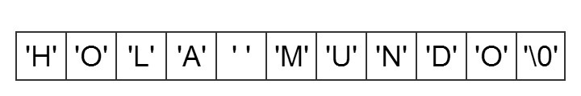

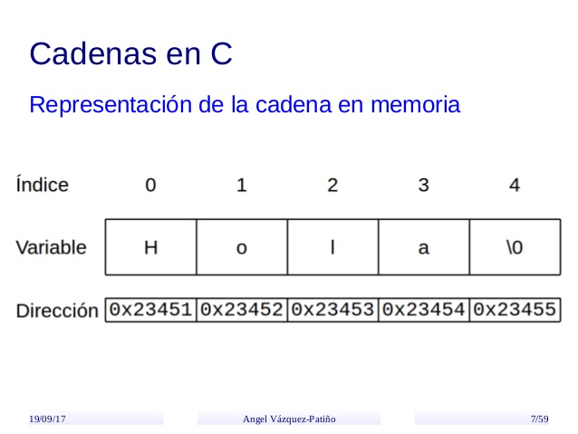

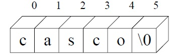


## **ARRAYS** (**Arreglos**)

Es una estructura que almacena datos en un tamaño asignado en la memoria; en éste tipo de arreglos (dependiendo del tipo de dato que se use). El número de elementos se especifica cuándo se crea o se declara definiendo el número de dimensiones mínimos o máximos que se define cómo *Rango*. Dependiendo del rango hay diferentes tipos de arreglos :

### **Arreglos unidimensionales (vectores)**

Por su simplicidad y mayor frecuencia de uso con los arreglos, los vectores presentan una ventaja en ser estructuras ordenadas cuando son estructuras lineales o de una sola dimensión. La declaración de un vector supone una reserva de espacio, asumiendo que, se asigne valores a cada uno de sus elementos; ya que si no se asigna un valor a un elemento, sólo se tendrá una estructura vacía.

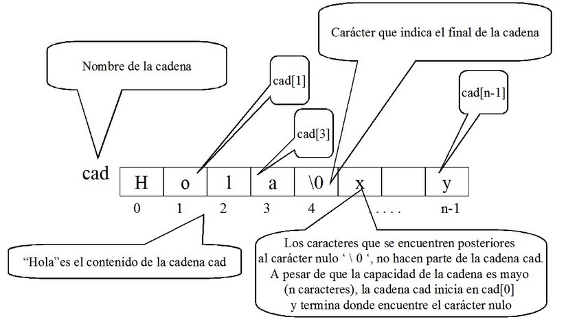

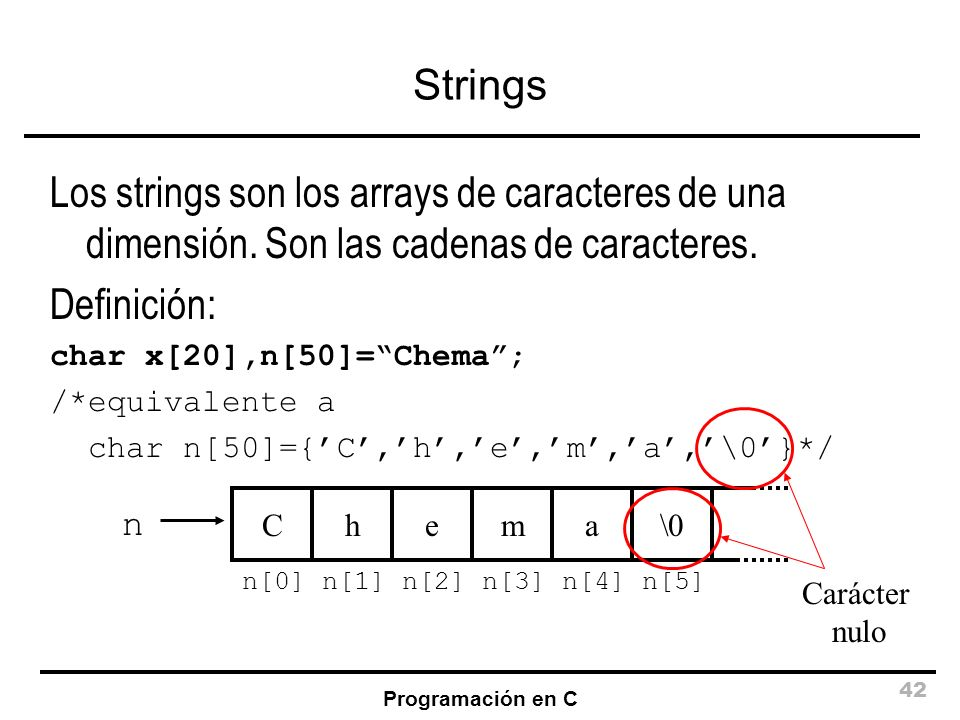

 Es posible que se puedan implementar arreglos cuyos elementos sean a su vez cadenas o elementos de otro tipo, asi cómo se muestra en el siguiente ejemplo en la fase declarativa :
 ```Shell
tipo : palabra = cadena[16]
COCHES = vector [1..9]de palabra
```
lo que permite tener en un solo vector hasta 9 cadenas que pueden contener hasta 16 carácteres o elementos en cada cadena, se despliega la información de ésta manera :

|Alfa Romeo|
|----------|
|**Fiat**  |
|**Ford**  |
|**Lancia**|
|**Renault**|
|**Seat**|
| --- |
| --- |
| --- |

De igual manera, se pueden realizar más operaciones con los arreglos sobre los vectores, son los siguientes :

+ **Asignación :** Es lo mismo que al asignar un valor a una varibale no dimensionada, ya que el vector representa lo mismo que una variable no dimensionada.
```Shell
A[20] = 5 asigna el valor 5 al elemento 20 del vector A
A[17] = B asigna el valor de la variable B al elemento 17 del vector A
```

+ **Acceso secuencial o recorrido del vector :** Consiste en recorrer todos los elementos de un vector o arreglo para someterlos a un determinado proceso, ya sea para introducir datos, visualizar su contenido, etc; se utiliza estructuras repetitivas, cuyas variables de control, se incremente en el bucle para dar el tratamiento en lo sucesivo a los elementos del vector.

Ejemplo: Escribir un algoritmo para recorrer secuencialmente un vector H de 10 elementos (haciendo la lectura y escritura de cada elemento) primero con un bucle *desde* y luego con un bucle *mientras*.

El pseudocódigo será el siguiente :
```Shell
desde i = 1 hasta 10 hacer   
        leer(H[i])
        escribir(H[i])
fin_desde

 i = 1
 mientras i <= 10 hacer
        leer(H[i])
        escribir(H[i])
        i = i + 1
fin-mientras
```
+ **Búsqueda binaria :** Se aplica para vectores o elementos que han sido previamente ordenados. Se le conoce cómo "divide y vencerás" para localizar el valor deseado. El algoritmo de búsqueda binaria consiste en los siguientes pasos :

1. Examinar el elemento central del arreglo o vector; si es el mismo valor deseado, entonces la búsqueda termina.

2. En caso contrario, se determina si el elemento buscado se encuentra en la primera o segunda mitad del arreglo o vector (de ahí el nombre de binario) y así repite el proceso hasta encontrar el valor deseado, utilizando el elemento central del subvector.

Como ejemplo, el siguiente arreglo ordenado de nueve elementos, vamos a buscar el valor **2983**

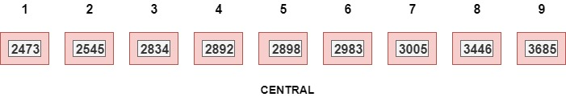   

Para buscar el elemento **2983**, se examina el número central **2898**, situado en la quinta posición. Al ser **2983 mayor que 2898**, se desprecia
la primera mitad del vector, quedándonos con la segunda :

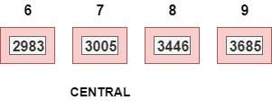

Se examina ahora el número central **3005**, situado en la posición 7, que resulta ser distinto. Al ser **2983 menor que 3005**, nos quedamos con la primera mitad del vector :

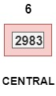

Finalmente encontramos que el valor buscado coincide con el central. Nótese que si el valor buscado hubiera sido, por ejemplo, el **2900**, la búsqueda habría finalizado
con fracaso, ya que, dentro del arreglo previamente ordenado no existe el valor de **2900**

La busqueda binaria podemos también representarla en un algoritmo en forma de pseudocódigo, se muestra en el siguiente ejemplo :

Para encontrar un elemento **K** en un arreglo de elementos **X(1), X(2),...,X(n),** previamente clasificados y ordenados de forma ascendente (si los datos son numéricos, de forma creciente y alfabéticamente si son carácteres). El proceso de búsqueda debe de terminar si se encontró el valor deseado con *la búsqueda ha tenido éxito* o bién con *la búsqueda no ha tenido éxito* en caso de no ubicar o encontrar el valor deseado; deberá de regresar a la posición del elemento buscado dentro del arreglo. las variables enteras **BAJO, CENTRAL, ALTO**, indican los límites inferior, central y superior del intervalo de la búsqueda, en cada subvector que sucesivamente se está considerando, durante la búsqueda binaria.
```Shell
Algoritmo Busqueda_Binaria
X : vector de N elementos
K : valor deseado de busqueda

inicio
    BAJO = 1
    ALTO = N
    CENTRAL = ent (BAJO + ALTO / 2)
    mientras BAJO < ALTO y X [CENTRAL] <> K hacer
    si K < X [CENTRAL]
        entonces
          ALTO = CENTRAL - 1
          si_no
          BAJO = CENTRAL + 1
    fin_si
      CENTRAL = ent (BAJO + ALTO / 2)
    fin_mientras
      si K = X [CENTRAL]
      entonces_escribir "Valor encontrado en :" CENTRAL
      si_no escribir "Valor no encontrado"
    fin_si
fin   
```

### **Arreglos bidimensionales (matrices)**

### **Arreglos multidimensionales**
