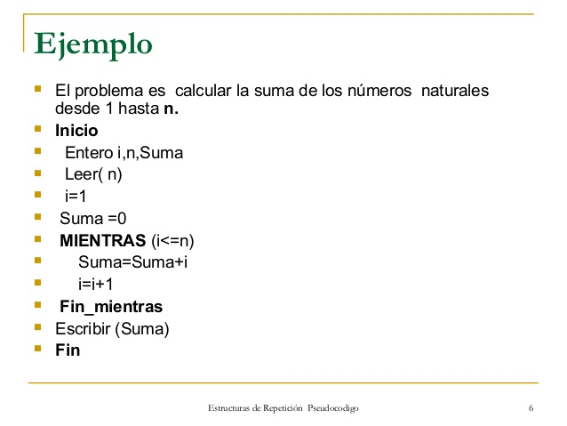

# **ALGORITMO**

## **Definición**

Es un conjunto de instrucciones o reglas bién definidas, organizadas y finitas que permiten solucionar un determinado problema mediante pasos sucesivos para obtener un resultado.

Generalmente los algoritmos está más asociados con el ámbito matemático, pero no siempre es así, ya que los algortimos podemos verlos en cualquier ámbito, por citar algunos ejemplos:

+ Una receta de cocina.
+ Instructivos para juegos de mesa.
+ Pasos para llegar a un parque.
+ Reglas al practicar un deporte.

Existen ciertas propiedades de los algoritmos que son:

1. Tiempo secuencial: funcionan paso a paso sin alterar su orden de ejecución

2. Estado abstracto: cada algoritmo es independiente de su implementación.

3. Exploracion acotada: la transición de sus estados queda fija y finita.

Hay varias formas de representar un algoritmo; en programación veremos las 2 formas más comunes de representar a los algoritmos:

## **Diagramas de Flujo**

Los diagramas de flujo son una represanción gráfica y sencilla de un algoritmo fácil de comprender para cualquier persona que no necesariamente tenga conocimientos de computación o informática.

Generalmente un diagrama de flujo representa un único punto de inicio y cierre. Los símbolos más representados en los diagramas de flujo son la **flecha** (que indica un sentido y una trayectoria), el **rectágulo** (que representa un proceso o evento), el **rombo** (una condición), el **círculo** (un punto de conexión de varios eventos o procesos).


## **Pseudocódigo**

El pseudocódigo es considerado cómo una descripción de un algoritmo que es totalmente independiente de los lenguajes de programación para que pueda ser interpretado por cualquier persona; se excluyen algunos datos que no son necesarios o irrelevantes.

Hay que tener en cuenta que para desarrollar el pseudocódigo, se deben de tener en cuenta con diversos tipos de **Estructuras de Control** que son de tres clases:

+ Selectivas. Las instrucciones selectivas representan instrucciones que pueden o no ejecutarse, según el cumplimiento de una condición

+ Secuenciales. Las instrucciones se siguen en una secuencia fija que normalmente viene dada de arriba hacia abajo.

+ Iterativas. Representan la ejecución de instrucciones en más de una vez.

La definición de los datos en el pseudocódigo se da por supuesta, sobre todo las variables sencillas, si se emplea formaciones cómo pilas, colas, vectores, o registros. Aquí se mencionan las más usuales e importantes:

**Funciones y operaciones**. Las operaciones aritméticas se usan y representan de la forma usual que en matemáticas.

**Bucles o condicionales**. Se repite mientras la condición sea cierta, si al llegar por primera vez la condición sea falsa, dependiendo de la estructura, puede repetirse o terminar la condición con dicha estructura.




# **ESTRUCTURAS DE DATOS**

## **Definición**

La estructura de datos es una manera organizada para manejar datos de manera eficiente para usos tales cómo consulta, *indexación de Internet*, etc. La estructura de datos es clave para el diseño de algortimos eficientes y métodos en los lenguajes de programación.

La estructura de datos en la programación son una forma de buscar la organización, manipulación, consulta e inserción de datos de una manera más eficiente.

Los diferentes tipos de arreglos en las estructuras de datos son las siguientes:

## **CADENAS**

Las candenas son las estructura más simple y se define cómo una secuencia lineal de carácteres alfanuméricos que se pueden interpretar cómo un único dato. Su longitud puede ser fija o variable. Sobre los datos de tipo cadena, se pueden realizar las siguientes operaciones:

1. **Asignación.** Se guarda un dato que puede ser una constante; una variable o una expresión que puede ser un dato tipo cadena. Por ejemplo:
```Shell
nombre <--- "Israel"
nombre <--- mi-nombre-de-pila
```

2. **Concatenación.** Se forma una cadena a partir de otras 2 ya existentes *yuxtaponiendo* los carácteres de ambas cadenas. Se denota con // al operador de concatenación, ejemplo:
```Shell
"ab" // "cd" es "abcd"
```

Notese que las constantes de tipo cadena se escriben entre comillas para no confundirlos con nombres de variables u otros identificadores.


3. **Extracción de subcadena.** Permite formar una cadena (subcadena) a partir de otra ya existente y la subcadena forma otro tramo consecutivo. Si NOMBRE es una variable de tipo cadena que contiene "ISRAEL ISAAC" y se denota por ( n : m ) la extracción de **m** carácteres tomados a partir del lugar **n** , entonces NOMBRE (8:5) es una subcadena que contiene a ISAAC.

De igual manera se puede aplicar para obtener un sólo carácter. Usándo el ejemplo anterior NOMBRE (8:1) = "I".

4. **Obtener la longitud de la cadena.** La longitud de la cadena es un dato tipo entero, cuyo valor es el número de carácteres que contiene ésta. La longitud se obtiene consultando el número de la primera casilla y de igual forma se puede obtener con la última casilla restando -1. 

## **ARRAYS** (**Arreglos**)

Es una estructura que almacena datos en un tamaño asignado en la memoria; en éste tipo de arreglos (dependiendo del tipo de dato que se use). El número de elementos se especifica cuándo se crea o se declara definiendo el número de dimensiones mínimos o máximos que se define cómo *Rango*.
