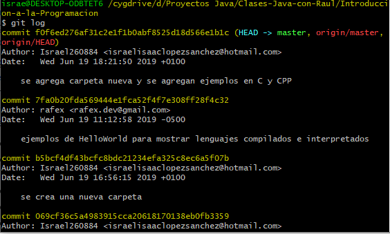
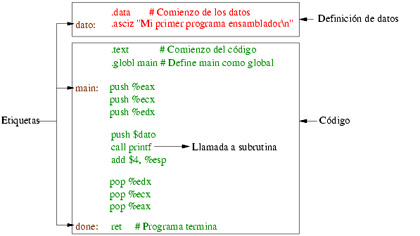
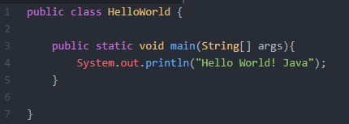

# Lenguajes de programacióm

  ### Definición.

  Un Lenguaje de Programación es un lenguaje formal que el programador escribe y permite que la computadora ejecute secuencias, órdenes y algoritmos para controlar de manera física (automatización) y lógica (software) de una computadora utlizando sus reglas gramaticales (léxico/morfologías, sintácticas y semanticas).

  

  Al proceso que aplica el programador/desarrollador en el cuál se escribe, se depura (de ser necesario), se compila y se mantiene el código fuente, es a lo que se le llama **Programa**, que a su vez es la que define la creación de **Software** mediante la aplicacion de ciertos procedimientos lógicos que sigue los siguientes pasos:

  1. Desarrollo lógico del programa para resolver un problema.

  2. Escritura del programa siguiendo sus reglas gramaticales (codificando).

  3. Ensamble o compilación para interpretarlo a lenguaje máquina.

  4. Prueba y depuracion del programa (si lo requiere).

  5. Desarrollo de la documentacion para llevar el control y el desarrollo del programa.

Los leguajes de programación se dividen en dos grupos:
+ Lenguaje de Bajo Nivel.

+ Lenguaje de Alto Nivel.

## Lenguaje de Bajo Nivel.

Las primeras computadoras se programaban directamente con el *lenguaje máquina* que estaba basado en el sistema binario usando el *0* y el *1* representando los impulsos electricos de los transistores y las pistas del *PCB* para así llevar a cabo las instrucciones que se les asignaba. El lenguaje de Bajo Nivel *siempre* ejerce un control directo del hardware y está condicionado al mismo con el cuál se le programó; no es posible que el mismo programa funcione en otra máquina/equipo diferente.

+ El lenguaje ensamblador es un ejemplo claro de Lenguaje de Bajo Nivel, usando expresiones (en inglés) traducen del programa ensamblador al lenguaje máquina a la velocidad de la computadora/equipo. El lenguaje puede ser comprendido por el humano, pero requiere ser traducido para que la máquina lo pueda interpretar.

### Ventajas:
+ Su proceso de compilado es más rápido porque es cercano al *lenguaje máquina*

### Desventajas:
+ No es comprensible o no se entiende para la mayoria de las personas que no tiene el conocimiento del lenguaje, sólo los programadores que se dedican y han practicado con algún Lenguaje de Bajo Nivel.

## Lenguaje de Alto Nivel.

El Lenguaje de Alto Nivel se caracteriza por usar comandos, sintáxis y lenguaje entendible para el ser humano usando algoritmos de una manera adecuada para la capacidad cognitiva humana.

El Lenguaje de Alto Nivel tiene un nivel de *abstracción* que puede usar matrices, objetos (Programación Orientada a Objetos), arimética compleja, subrutinas y funciones, bucles, hilos y cierres.

Conforme avanza la tecnología, los lenguajes de programación evolucionaron y se estan adaptando para tener una gramática más comprensible para el ser humano, usando sintáxsis, palabras o expresiones (por lo general en inglés) para facilitar el entendimiendo del mismo.

### Ventajas:
+ Genera un código más sencillo y comprensible

+ Se puede usar el mismo código en cualquier máquina/equipo siempre que contenga la misma herramienta de desarrollo.

+ Puede soportar varios Sistemas Operativos para ejecutarse

### Desventajas:
+ Su proceso de compilado es más tardado en comparación con el Lenguaje de Bajo Nivel ya que requiere que se compile y después interprete al *lenguaje máquina*

